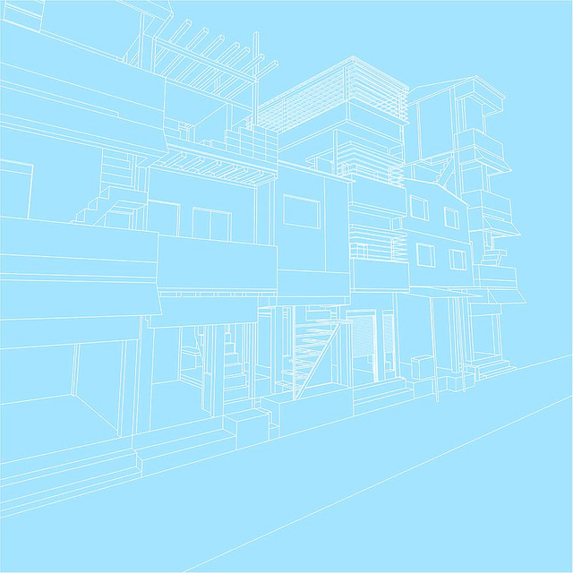

This is the summary of a talk given at Oris – House of architecture, Zagreb, Croatia on June
16th 2016, which was part of the the Future Architecture Platform. Illustrations by Ismini
Christakopoulou, Matias Echanove and Rahul Srivastava.  

The modern notion of the future is based on a Biblical timeline, which has raised messianic
expectations ever since Daniel’s prophesies. Such an understanding of the future even spills
over into worlds where a more cyclical notion of time dominates – for example in the Asian
context – and generates constant excitement of impending change. It prevails also in secular
milieus, which believe that our future should be in our own hands rather than in those of the
divine.

The quest for a better future is something that seems to infuse modern life, from political
revolution to consumerist aspirations, from technological fantasies to ecological utopias (and
dystopias). The strong faith in the possibility of a future that is radically different from the present
has fueled architectural ambitions throughout the twentieth century. And it still prevails in some
of the most dominant architectural practices today. ‘Parametricism’ being its latest and most
hopeless expression.

Such moves are locked in linear time, where the past becomes a source of nostalgia or a vast
archaeological site to be preserved in museums, while rendering the future into an amusement
park of technological wonders, which promises to leave the misery of the world outside. Such
grand architectural gestures always seem to provide the future in a self-contained form,
managing to exclude misery out altogether in that ideal world.

The present becomes an awkward point of transitioning from an imagined past into a desirable
future. It also has the irritating habit of tripping big plans and visions, by asking mundane and
profane questions. It is in the present that ugly, mistaken or confused architecture sits cheek by
jowl with political problems that challenge architectural ambitions.

Narratives of injustice and poverty may clearly go beyond the scope of architecture as a
discipline. However, that doesn’t prevent the well-meaning architect to make a valiant attempt at
becoming a saviour. He gathers as much of political energy as he can and gifts his architectural
solution to the world, which can either emerge in the form of a master plan (for instance to
rehabilitate millions of slum dwellers) or as a small but perfectly controlled architectural object
(such as the $300 house project -R.I.P.). That these projects actually have no relationship to the
context they are supposed to transform doesn’t bother him the least.

To the young heroic architect aiming at making a difference, looking at the present is not as
straightforward as it seems. Especially when the dominant gaze is already coloured so heavily
by a linear notion of time. The present is infinitely complex and dynamic, fusing the familiar with
the unknown with disconcerting fluency.

Thankfully, linear time is not the only way to relate to the world. If anything at all – it only seems
to distract us from a creative, imaginative and direct engagement with the present.
The present contains its own ‘becoming’. It inevitably moves in different directions, pushed and
pulled by all of us. But we, who produce the present, are also firmly embedded in it. The present
absorbs the future – not through the projected fantasies of a few visionaries but through the
chipping and shaping away of the present by those who live in it – the unruly multitude of
inhabitants.

The full range of architectural concerns, where the language of space, time and depth shape
worlds and animate built-forms are all pervasive processes. These are important and exciting
holistic moments. It is a real pity to split them up along a linear representation of time.
What would a practice of architecture and urban design that is not projecting ‘the future’ look
like? One which is rooted in the present, rather than in a nostalgic notion of the past, or a
wonder of the future, even though it may be inspired from and powered by those fantasies?
The notion of ‘recognition’ provides an important clue. Forms would not simply be projected out
of nowhere, but are based on the recognition of processes at work in the production of places
(economic, cultural, political). ‘Form follows recognition’ is the tagline of our current exhibition at
the <ins>House of Architecture in Graz</ins>. In our introduction to the exhibition we explain that:*
The process of recognition involves a reorientation of our gaze, and the way we interpret and
deal with the world around us. It is about framing the reality in a way that allows us, and
everyone else, to become legitimate actors. It is about the acceptance of our world as an
unfinished and imperfect, collective work in process. And taking part in that process.*

According to Amitav Ghosh, “Recognition is famously a passage from ignorance to
knowledge... The knowledge that results from recognition ... is not of the same kind as the
discovery of something new: it arises rather from a renewed reckoning with a potentiality that
lies within oneself.” (The Great Derangement, 2016, pp: 5-7). The act of recognition thus
involves the establishment of a relationship between the subject and the object – which may be
almost fusional. It is not a passive observation but an active engagement with the present and
the potential that it embodies. Pre-cognitive forms of intuition and creativity thus have a central
role to play in the act of recognition.

In another exhibition, currently showing at the Maxxi in Rome, we show wood, steel and acrylic
models of ‘dream tool-houses’ designed by artisans in Dharavi, Mumbai, with the help of the
urbz team. A tool-house is a typology that is very typical of unplanned settlements such as
Dharavi, but which is also pervasive throughout Asia – from India to China and Japan. It merges
residential functions with productive functions, thus optimising the use of space in dense
neighbourhoods.

The tool-house models we produced with local actors in Dharavi are fictional and idealised
representations of the reality they live in. They represent a potential that is at once hopeful and
pragmatic, which draws on local skills and responds to local needs better than any utopian
urban design for the future of Dharavi ever could.
