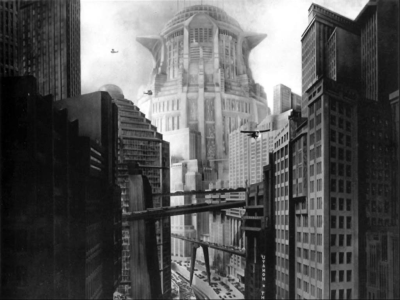

Urban practice has become increasingly speculative about the future. If there is a world where
utopias are literally a commodity, bought and sold as little pieces of dreams, it is here. Full of
futuristic and visionary images about the way the world should look, buildings, neighbourhoods
and entire regions seem afloat in space, free from the constraints of the lived world. They do
seem to have a clear source, however, derived largely from fictional scenarios of the future of
humanity. While apocalypse, paradise, utopia and dystopia are the moral anchors for several
speculative fables, the city is evoked as double-edged – at once the pinnacle and tipping point
of human choices. This essay demonstrates how speculative fiction limits the idea of the urban future and with it restricts choices we make in the present. If fiction is another mode of activist
expression, it is being sculpted and shaped in concrete and glass as well.
*(Abstract of the essay by Matias Echanove and Rahul Srivastava to be published by THE
JOURNAL OF SOUTH ASIAN FILM AND MEDIA VOL.6 NO.2)*

(Metropolis - Source: https://upload.wikimedia.org/wikipedia/en/2/28/Metropolis-new-tower-of-babel.png)

In movie lore, Fritz Lang’s Metropolis (1927) is the fountainhead of subsequent futuristic urban
imagery in cinema. The director is known to have been inspired by his first glimpse of New York
that bloomed into his gigantic futuristic, art-deco cinematic city in which a twisted class war and
biblical themes came together to carry forward a strange tale of control, love and human
choices (Minden and Bachman 2002). The authors point out that the imagery in the film – tall
skyscrapers, looming giant urban landscapes, machines merged with built forms – is said to be
inspired by the futurist Italian architect Antonio Sant’Elia, but the film’s own design influenced the art-deco movement substantially in Europe and America as well. This interplay of early
twentieth-century architectural movements and cinematic representations produced a set of
images that became hugely influential, continuing to be the template on which notions of urban
futures kept echoing through the twentieth century. Widespread notions of the city remain
anchored to similar or related visions.

The city, thus, very much remains entrenched as the alter ego of the rural: a very
twentieth-century and industrial idea (Leeds 1994). If we detach such a notion of the city as we
have imagined it in the twentieth century (thanks in no small measure to movies like this one)
and actually take a hard look at the way urban forms proliferated in the contemporary world, we
see a gap that needs to be filled in more creatively than simply by a temporal logic of urban
development where everybody would eventually catch up.

The actual processes through which cities relate to density and space, how they create habitats,
their relationship to what they call home in different parts of the world, the surprising ways in
which they use transport and mobile systems rarely become the starting points of imaginative
reconstructions that circulate in the media and, subsequently, in our minds. Research emerges
year after year from India, Europe, China or Africa, which reveals complex patterns of
urbanization, unexpected directions that people take in shaping and using habitats that certainly
does not point towards the vertical, speedy, hyper-dense spaces that presently haunt our stories
and minds (Brenner 2004; Kaufmann 2014 ; Echanove and Srivastava 2014). Such research
reveals that villages are becoming a part of urban living, populated forests, and high-technology
rural habitats are as much a conjoined living reality as mobile phones and the Internet, and
populations are circulating and moving in unexpected directions. Thus, the urban landscape of
the future may be much more varied than we imagine. The reason why it takes much longer for
these observations to become the knowledge stock and springboard for imaginative
constructions is because they challenge very deep taken-for-granted notions about the future.
