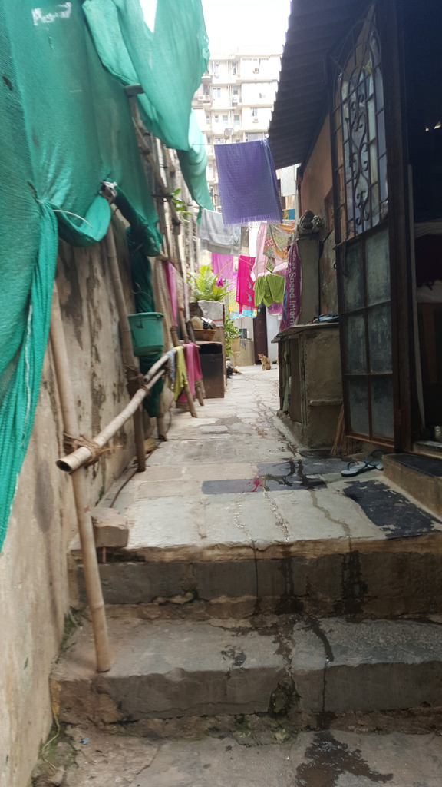

Organic metaphors for cities have been in fashion at least since Patrick Geddes (1854 – 1932).
A biologist by training, Geddes turned to city planning when his eyesight became too defective
to use a microscope. He imagined a city as not fundamentally different from any other living
organism.

A city seems to follow a logic of its own, complex and mostly spontaneous. It grows and mutates
taking different forms and functions. The only difference between a city and an organism, is our
conviction that we can plan the former, while we see an organism’s internal capacity to grow and
structure as divine.

Tampering with biological cells, whether animal or vegetal, is seen as sacrilegious. Think of the
strong movement against genetically modified organisms. The fear is that we may create types
of organisms that could get out of hand, go viral and threaten biodiversity. Playing god may endanger and impoverish the realm of our own existence. The related worry we have with GMO
is that these extra-dominant strains tend to become the property of corporations that control and
impose their terms on farmers and consumers.

At one level these fears are real. We don’t want any cartel to dominate the food industry.
Organic food, farmers’ markets and guerrilla gardening are healthy reactions to a form of
capitalism that threatens the livelihood and autonomy of producers and consumers.
At another level, we can’t treat nature as sacrosanct and out of bounds of human engagement.
We’ve always been tampering with it and always will. However much we pollute and exploit it,
we are part of nature.

Forests have forever been inhabited by humans. Their ecosystem depends on us as much as
we depend on them. Even “pristine” forests have relied on intricate and interfering knowledge
systems, which humans living in and around them possessed for their co-dependent survival.
We can’t reduce nature either to something pure that must remain untouched or a raw resource
that we should freely exploit. Either way this amounts to physically and conceptually evacuating
human presence, and makes way for nature’s total sacralisation or devastation. Both of which
are happening simultaneously today.

Nature is messy, contradictory, predatory. Harmony is a beautiful invention of the mind but as
green-architect and nature-lover Michael McDonough once told us pointing to a
harmless-looking creeper growing around a serene-looking tree: “it is a war out there.” He saw
his role as that of a peacekeeper. There is a lot humans can do to monitor and support nature
that doesn’t involve destroying it, as the greening of arid regions in Israel and India have shown. 

Could the same thing be true of cities? Can we manage them without killing their diversity and
spontaneity? Geddes certainly thought so.

We are only starting to understand how we can alter an organism’s genetic code, while we have
been planning cities and neighbourhoods since Sumerian times. The problem is that we have
never been very good at it, or perhaps we lost those skills in modern times. Master planned
cities usually turn out to be disasters, and our proud megacities, which are colonizing the planet
from Shenzhen to Santiago are the result of the same Monsanto brand of capitalism that kills
diversity in the name of efficiency and profit. The problem with this model is that it is crisis-prone
and offers a highly uneven quality of life.

Maybe it is time we start recognizing human agency as an active principle in urban growth. We
must see beyond planning and engineering as ways of organizing habitats, and invent methods
that involve users and residents and their dynamic acts. We must start seeing people as the
building blocks of cities and open the planning process to them.

Unfortunately, even as the rhetoric of participation dominates the urban planning discourse from
Tokyo to Toronto, and at a time when hundreds of thousands of communities of users interact in
responsive networks and games, we seem unable to open up urban practices. Urban
development still tends to be managed by technocratic planning agencies, which serve the
interest of real estate speculators more than that of end-users.

There are a few concepts that we love to use, like the title of this article, precisely because they
evoke an oxymoronic world were nature and city not only coexist but blend into each other. This
vision is not one of LEED-compliant buildings with floral facades and smart cities surrounded by
green belts that preserve “nature” out there. No, we do not need to preserve the city from nature
or vice-versa. The two work best together.

Above all, the natural city is one where human nature can express itself. Where the act of
making a home is as natural as plucking fruits from trees. It is a place where habitat develops
continuously, in response to the changing needs and means of the people who live in them. And
where objects, homes and places can be produced locally by mixing native skills with the most advanced technology available. Where the architect is also a builder and a resident. Where the
users are the developers. And where rules follow forms rather than the other way around.
While this sounds like a utopia straight out of a Jehovah’s Witness brochure, it is in fact a reality
that exists in rather complicated “slums” the world over, from Mumbai to Madrid. Destitute
people have demonstrated what the dark side of this vision looks like. They live in homegrown
neighbourhoods, built locally by resident contractors in vernacular fashion, using whatever
resources they can access. They usually lack resources, but what they lack most is the right to
improve their habitats on their own terms.

What policy-markers, planners and architects usually do when confronted by what looks like
feral urbanization is to ghettoize or destroy it. Sometimes the authorities can’t cope with the
magnitude of such growth, and let it be. Some enlightened souls praise the “informal city” – but
this has become a catchall phrase as flabby as blobs in architecture. Others suggest “tactical”
interventions, but as Neil Brunner observes these are not antidotes to “the vicissitudes,
dislocations, and crisis-tendencies of neoliberal urbanism.”

What we need instead is a fundamental reshuffling of our conception of how a city grows.
Growth must be redefined and reclaimed if what we want is a city that is diverse, fertile, creative,
but also inclusive, beautiful and resilient. We may have to stop trying so hard to plan and
control, and recognize the city’s inherent capacity to evolve.

The vital force at work in cities is not divine, but eminently human. We must trust users and give
them the right and means to improve their habitats and shape it in small and big ways. Users
should be empowered to meddle with the code of their urban environment and create new
urban genomes – as they have always done. We should not allow real estate developers to
monopolize the engineering of cities in ways that only benefit them. In this process, the users
best ally could well be the architect, the urban planner and the policy-maker –if only they
learned to observe the natural city before planning it, as Geddes already did a century back.

